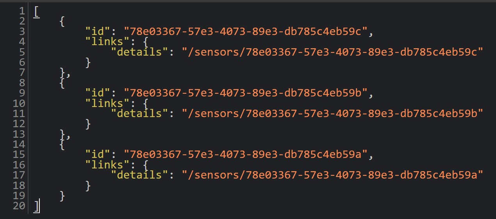
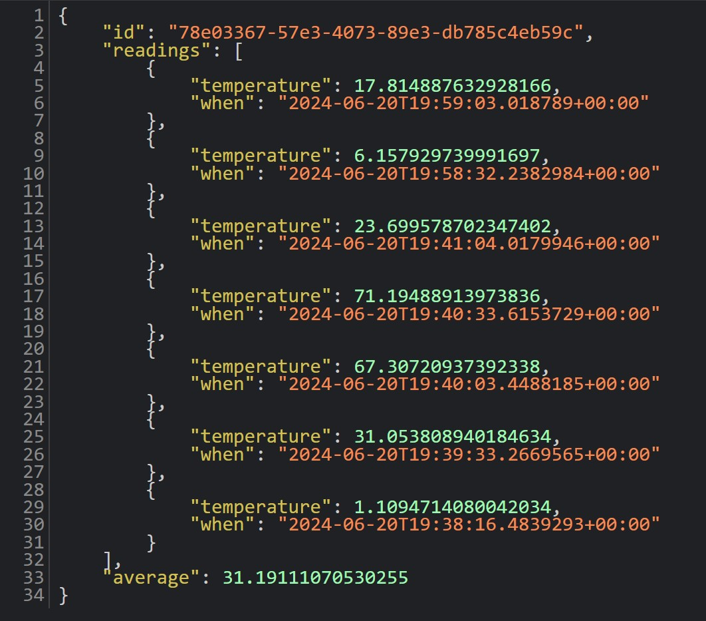

# TemperatureSensors
This sample shows how to use a [Background worker](./SensorsFakeProducer.cs) to publish `ReadingReceived` for each temperature sensor. Two GET endpoints are exposed to retrieve the list of available sensors and its relative details.

The list of available sensors can be retrieved via GET request at `/sensors`:

Sensor-specific details can be pulled via GET request at `/sensors/[sensor ID]`:

When querying for a sensor's details, the list of events for that stream is pulled from the API in backward order (newest first) and aggregated to calculate the average temperature.